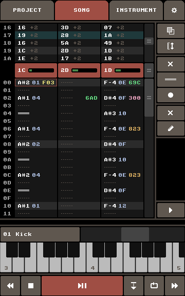

# GTMobile

*Create authentic C64 SID music on the go!*

GTMobile is an Android app for creating C64 SID music.
It is based on and (mostly) compatible with the original [GoatTracker 2](https://sourceforge.net/projects/goattracker2/).

GTMobile is licensed under the GNU General Public License v2.0 (GPLv2).

Get the app from the [Google Play Store](https://play.google.com/store/apps/details?id=com.twobit.gtmobile).
Feedback is wellcome!

### Support This Project

GTMobile is a free and open-source project made with love for the C64 music community.
If you enjoy using GTMobile and would like to support its development, consider [buying me a pizza](https://buymeacoffee.com/twobit)!

### Change Log

+ 2025-01-21 – 1.0.5
  + long press of edit button jumps to corresponding instrument table if table pointer command is selected
  + configurable register write order

+ 1.0.4
  + separate copy buttons in pattern select for notes and effects
  + transpose buttons in track select
  + extra play button to play from current pattern position
  + long press of instrument button picks up instrument of pattern cursor
