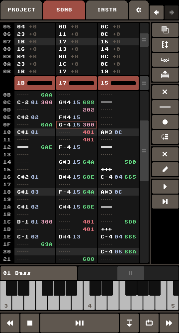

# GTMobile

*Create authentic C64 SID music on the go!*

GTMobile is an Android app for creating C64 SID music.
It is based on and (mostly) compatible with the original [GoatTracker 2](https://sourceforge.net/projects/goattracker2/).

Get the app from the [Google Play Store](https://play.google.com/store/apps/details?id=com.twobit.gtmobile) or [GitHub Releases](https://github.com/2bt/GTMobile/releases).
Feedback is welcome!
The [manual](https://2bt.github.io/GTMobile/manual/) describes the controls.

GTMobile is licensed under the GNU General Public License v2.0 (GPLv2).

### Support This Project

GTMobile is a free and open-source project made with love for the C64 music community.
If you enjoy using GTMobile and would like to support its development, consider [buying me a pizza](https://buymeacoffee.com/twobit)!
